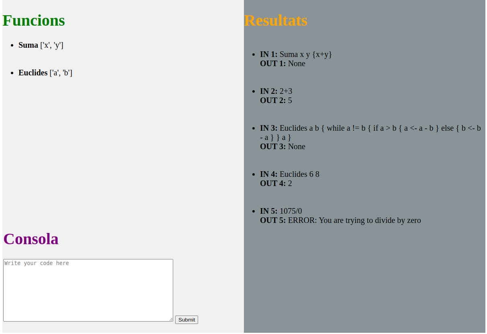

# Funx

Aquesta pàgina es la descripció de l'entrega de la pràctica de LP (2022-2023 Q1). Es tracta de la implementació d'un intèrpret per a un llenguatge: Funx. Funx és un llenguatge de programaciço basat en expressions i funcions.

## Visió general

Amb Funx podem definir funcions i acabar, opcionalment, amb una expressió.
Els comentaris es realitzen amb `#`. 
Cada funció té un nom (que comença per majúscula), paràmetres i un bloc associat. Els blocs es troben inscrits entre els símbols { i }. Les variables començen per minúscula.
Les funcions tenen més d'un punt de sortida, això és perquè retornen el valor de qualsevol expresssió que trobin en el seu bloc. Els paràmetres es passen per còpia.
Aquest exemple il·lustra el comportament detallat:

`Suma x y { x + y }`
`Suma (2 * 3) 4`
`Out: 10`

Les funcions a Funx compten amb recursivitat. Les variables són locals a cada invocació de cada funció i les funcions es poden comunicar a través de paràmetres.
`Fibo n{
    if n<2 {n }
    (Fibo n-1) + (Fibo n-2)
 }
 Fibo 4`
`Out: 3`

Les variables no han de ser declarades, totes seran de tipus enter. No existeixen operacions de lectura ni d'escriptura.
Les funcions poden no tenir paràmetres.

## Característiques específiques

### Assignació : `<-`
### Condicional:
    if condició {bloc}
    
    if condició {bloc1} else{bloc2}
    
El else és opcional.

### While: semàntica habitual
### Crida a la funció:
Si el nombre de paràmetres passats no corresponen als declarats, es produeix un error. Les funcions es poden cridar recursivament.
### Expressions
Operadors aritmètics: +,-,*,/,%,^
Operadors relacionals: !=, =, <,>,<=,>= (True=1, False=0)

### Errors:

    - Divisió per zero
    - Crida a una funció indefinida
    - Declaració d'una funció ja definida
    - Crida a una funció amb el nombre incorrecte de paràmetres
    -Declaració d'una funció amb variables repetides
Aquests són els errors que detecta funx.

### Extensions:
    - Elevar a... ('^')
    - Funció print
    - Treballar amb nombres negatius
    - Part visual: Text per defecte a la consola
### Intèrpret 
L'intèrpret de funx permet tenir una visió més clara i còmodo del llenguatge. Es composa per 3 seccions, la _Consola_ on s'itrodueix el codi a traactar; les _Funcions_ on es visualitzen les funcions declarades i per últim les respostes de les entrades.

## Com realitzar proves:
S'adjunten alguns tests senzills per les extensions. En aquesta carpeta es troba tot el necessari per poder provar funx.
Per l'intèrpret s'han d'invocar les següents comàndes:
`export FLASK_APP=funx
flask run`
i la comanda antlr4 és la següent:
`antlr4 -Dlanguage=Python3 -no-listener -visitor funx.g4

